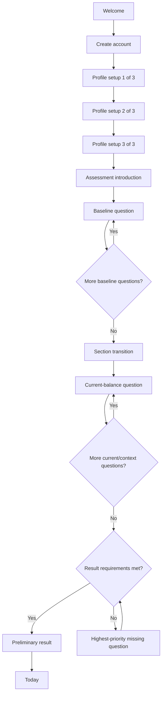

# Assessment Flow

## Status

Low-fidelity interaction specification for the first mobile prototype. The canonical questions and answer choices remain under `data/quiz/`.

## Primary vertical slice

## Navigation model

- Welcome, sign-up, profile setup, and assessment are focused flows without bottom navigation.
- A back action appears where it will not discard required consent or account state.
- “Save and exit” appears from assessment introduction onward and returns to a resumable home/interstitial state.
- Primary bottom navigation appears after the assessment reaches Results and the user enters Today.
- Deep links into post-assessment screens redirect an incomplete user to the appropriate resume point.

## Flow states

| State | User sees | Primary action | Alternate actions |
| ----- | --------- | -------------- | ----------------- |
| Welcome | Product category, tagline, brief value, boundary link | Create account | Sign in; wellness disclaimer |
| Profile 1 | Preferred name and age band | Continue | Back |
| Profile 2 | Optional device location, adjustable map pin, and units | Use this location | Choose on map; manual search; skip; back |
| Profile 3 | Dietary pattern, allergies, exclusions | Save and continue | Back; skip optional fields |
| Assessment intro | Time, two sections, saving, skip, educational boundary | Begin assessment | Exit |
| Baseline question | “Your usual nature,” progress, prompt, answers | Continue after selection | Not sure; skip; back; save and exit |
| Transition | Explicit shift from lifetime to past-seven-days frame | Continue | Save and exit |
| Current question | “Your current balance,” progress, recent time window | Continue after selection | Not sure; skip; back; save and exit |
| Missing coverage | More information needed and why | Answer next useful question | Exit |
| Coverage result | Separate baseline/current coverage and scoring boundary | Go to Today | Repair coverage |
| Today | Daily focus and practical action | View action or guidance | Questions; why chosen; AI entry |

## Question-screen behavior

### Presentation

- Show one question at a time.
- Show section label, “Question n of 27,” and a progress bar.
- Repeat or clearly imply the relevant time window in the prompt.
- Show optional help only when requested; opening help must not reset selection.
- Use full-width answer buttons with at least 44 px height and sufficient spacing.
- Keep “Not sure” in the answer list because it is a stored response.
- Keep “Skip for now” outside the answer list because it means no answer was submitted.

### Selection and advancement

1. Tapping an answer selects it and enables Continue.
2. Selection does not automatically advance.
3. Tapping another answer changes the selection before submission.
4. Continue saves the selected answer and advances when persistence succeeds.
5. Back returns to the previous question with its selected answer preserved.
6. Editing an already saved answer creates the appropriate superseding record in production behavior.

### Saving and connectivity

- Save every submitted answer immediately.
- Show quiet states: “Saving…”, “Saved”, and “Not saved—retrying.”
- If connectivity fails before submission, preserve the local selection and keep Continue available for retry.
- Save and exit must report whether the current unsent selection was saved, discarded, or retained locally.
- Resume at the next unanswered high-priority question, not necessarily the next numeric ID.

### Skip behavior

- “Not sure” submits the explicit fallback answer defined in structured data.
- “Skip for now” records no answer and leaves the question eligible for later presentation.
- Skipping should not trigger shame, warnings, or repeated confirmation.
- If result coverage is blocked, explain which kind of information is still needed without forcing disclosure of a specific sensitive answer.

## Section transition

After the last baseline question, interrupt the repeated question rhythm with a full transition screen:

> Now let’s look at how you’ve been feeling recently.

Supporting copy:

> Think only about the past seven days. These answers help us understand your current balance separately from your usual nature.

Do not show a dosha result or partial score at the transition.

## Coverage-result gate

The prototype must support both outcomes:

- **Requirements met:** show coverage-ready baseline/current counts and explain that dosha scoring is unavailable.
- **More information needed:** explain that a few important areas lack coverage and present the highest-priority missing question.

The limited MVP versions the documented 22 submitted / 14 substantive baseline / 4 substantive current gate as `coverage-policy-0.1-provisional`. It reports category coverage without making categories blocking because canonical set items mark none as required. The gate is a product-testing rule, not scoring confidence or medical certainty.

## Prototype test scenarios

1. Complete the happy path with all representative questions answered.
2. Select an answer, change it, and continue.
3. Use Not sure and explain what the system recorded.
4. Skip a sensitive question and resume it later.
5. Exit midway, sign back in, and resume.
6. Lose connectivity after selection and recover without losing input.
7. Reach the section transition and correctly change time-frame interpretation.
8. Reach results with sufficient coverage.
9. Reach the missing-coverage state after several skips.
10. Move from results to Today and identify the primary daily action.
