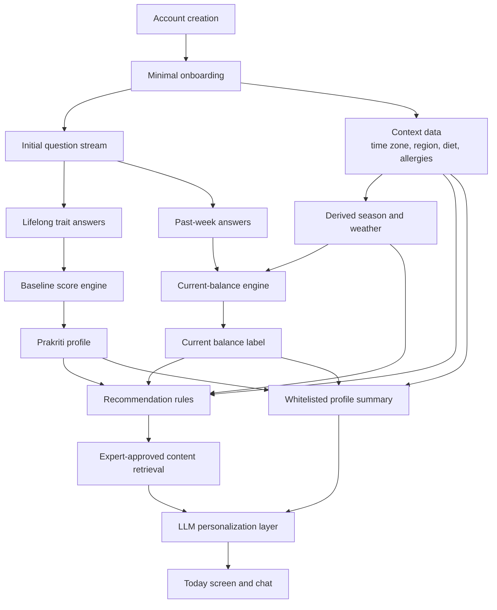

# User Profile Variables for Dosha Companion

## Executive summary

For a mobile-first consumer web app, the strongest evidence-backed pattern is to keep **account and onboarding data minimal**, and move most **dosha-relevant information into the question stream**. Official Indian Ayurveda bodies and modern reviews consistently describe prakriti assessment as relying on **physical, physiological, psychological, and behavioral traits**; modern tools also use anthropometric or observational items, but reviews note that many published tools remain heterogeneous and only partially validated. That makes a **deterministic, transparent, versioned scoring model** a better fit for an MVP than a black-box classifier or free-form LLM scoring.[^ccras-manual][^critical-review][^scoping-review]

Ayurvedic sources and reviews also support a clean separation between **baseline constitution** and **current balance**. Prakriti is traditionally treated as relatively stable, while vikriti or current imbalance is changeable and shaped by diet, routine, environment, stress, and season. In product terms, that means lifelong or “usually true” items should feed a slowly changing **baseline profile**, while “past week” items and daily context should feed a rapidly decaying **current-balance state**.[^scoping-review]

For the MVP, the minimum practical design is: collect only account basics plus a few stable personalization fields at sign-up; ask **20–30 high-yield assessment questions** immediately after signup; calculate a preliminary profile after enough answers are present; then continue refining via short question batches. The best Tier 1 variables are body build, skin and hair tendencies, appetite, digestion/bowel tendency, sleep, energy/movement pace, temperature tolerance, sweating, memory/learning pattern, stress response, routine preference, and endurance, plus a small set of “past week” questions for sleep, digestion, appetite, energy, mood, temperature, dryness/heat/heaviness, and routine regularity. Those domains recur across CCRAS/AYUSH materials and modern prakriti tools.[^ccras-manual][^critical-review][^scoping-review]

Privacy-wise, many seemingly simple fields become sensitive once linked to a health-style profile. Health-adjacent app data may trigger data-protection and breach-notification duties depending on jurisdiction; health data is treated as specially protected in UK GDPR-style regimes, and U.S. rules such as the FTC Health Breach Notification Rule can apply to health apps even when HIPAA does not. The safest MVP posture is to avoid exact birth date, exact GPS, complexion/photo analysis, precise weight/BMI, medication data, pregnancy details, and free-text symptom narratives unless there is a clear expert-approved use case. Send only a **minimal structured summary** to the LLM, not raw full-history data by default.[^critical-review][^hhs-hipaa][^ftc-hbnr][^ico-health]

## Evidence base and design principles

Ayurveda frames health around the relative balance of **Vata, Pitta, and Kapha**. The Ministry of Ayush describes health as equilibrium of the tridoshas, and CCRAS materials describe prakriti as the relative proportions of these doshas that shape an individual’s constitution or temperament. CCRAS’s standardized prakriti work states that its tool was built from classical Ayurvedic texts and expert consultation, and groups predictors into **physical, physiological, psychological, and behavioral** traits.[^ccras-manual][^critical-review][^scoping-review]

Modern reviews are broadly consistent with that structure. Recent reviews identify common prakriti variables such as **body build, hunger frequency, skin complexion or appearance, sleep patterns, voice characteristics, tolerance to temperature, taste preference, mental characteristics, body movement, endurance, appetite, food quantity, memory, and competitiveness**. At the same time, review literature emphasizes that existing prakriti assessment tools are numerous and methodologically uneven, which argues against overclaiming scientific certainty for any consumer app’s dosha output.[^ccras-manual][^critical-review][^scoping-review]

That evidence base supports five practical product principles for Dosha Companion. First, **separate stable constitution from current imbalance**. Second, **prefer structured questions over free text** for scoring. Third, **treat mobile self-report differently from clinician assessment**: CCRAS’s full standardized process includes measurement and observational steps, but a consumer web app should use app-appropriate substitutes. Fourth, **version the scoring model** because the field is still evolving. Fifth, **avoid medical framing** because NCCIH notes that evidence for many Ayurvedic interventions remains limited and some preparations can be unsafe, especially those involving heavy metals.[^nccih][^fda-wellness]

One further design implication matters for engineering: CCRAS’s manual explicitly warns about confounders in anthropometric traits and notes that current weight may be misleading when disease or major change has altered appearance, recommending consideration of earlier healthy-state appearance instead. In an app, that is a strong reason to prefer **self-perceived lifelong body tendency** over exact current weight or BMI in the MVP.[^ccras-manual][^critical-review][^scoping-review]

## Proposed field schema

The schema below translates traditional domains into app-ready fields grouped into **account**, **stable onboarding**, **question-stream**, **context**, and **derived** data. The field choices are a product proposal grounded in official trait categories and modern reviews, not a claim that Ayurveda has one universally accepted digital schema.[^ccras-manual][^critical-review][^scoping-review]

### Account and stable onboarding fields

| Field | Type | Collect when | Sensitivity and key concerns | Baseline vs current effect | Suggested values | Expiration or decay | Send to LLM |
|---|---|---|---|---|---|---|---|
| `user_id` | UUID | Account creation | Low; internal identifier only | None | System-generated | Never expires | No |
| `email` | Email | Account creation | High; direct identifier | None | Valid email | Never expires | No |
| `auth_provider` | Enum | Account creation | Medium; security-related | None | password, magic_link, oauth | Never expires | No |
| `preferred_name` | Short text | Account creation | Low | No scoring effect; used for tone | user-entered | Update anytime | Yes |
| `locale` | Enum | Account creation | Low | No score; controls language and culturally appropriate copy | `en-US`, later others | Review if changed | Yes |
| `time_zone` | IANA TZ | Account creation or auto-detect | Low | Indirect effect on daily post cadence | `America/Los_Angeles`, etc. | Update on change | Yes |
| `subscription_status` | Enum | Billing | Medium; commercial | None | free, trial, paid, canceled | Real time | No |
| `age_band` | Enum | Onboarding | Medium to high; health-adjacent | Weak effect on baseline; moderate effect on content tone, life-stage, and safety routing | 18–24, 25–34, 35–44, 45–54, 55–64, 65+ | Annual confirmation | Summary only |
| `sex_assigned_at_birth`* | Enum | Onboarding, optional | High; potentially sensitive and jurisdiction-dependent | Only use if expert has a pre-specified reason; default no or very low weight in MVP | female, male, intersex, prefer_not_to_say | No decay; editable | No by default; summary only if explicitly justified |
| `country_region` | Enum | Onboarding | Medium | No direct score; helps season and content localization | country + state/region | Review if changed | Yes |
| `postal_prefix_or_city` | Short text/enum | Onboarding, optional | High if too precise; location is sensitive | No direct baseline score; supports climate, season, and produce suggestions | city or postal prefix, not exact GPS | Refresh when changed | Summary only |
| `dietary_pattern` | Enum | Onboarding | Medium; health-adjacent | No dosha score; filters food content | omnivore, vegetarian, vegan, pescatarian, other | Review on change | Yes |
| `food_allergies` | Multi-select | Onboarding | High; health data | No dosha score; strong safety filter | nuts, dairy, eggs, soy, gluten, shellfish, sesame, other | No decay; editable anytime | Yes, but only as filtered exclusions |
| `major_food_exclusions` | Multi-select | Onboarding | Medium | No dosha score; content filtering | avoid spicy, avoid dairy, no onion/garlic, low-FODMAP, other | Review on change | Yes |
| `units_preference` | Enum | Onboarding | Low | None | US, metric | No decay | Yes |

\* `sex_assigned_at_birth` is traditionally relevant in some Ayurvedic contexts, but for a consumer wellness MVP it should be **optional, expert-justified, low-weight if used at all, and excluded from default LLM context** because the value is sensitive and often not necessary for initial recommendations. Health and related data can fall into specially protected categories depending on jurisdiction.[^hhs-hipaa][^ftc-hbnr][^ico-health]

### Lifelong and usually-true question-stream fields

These are **not** onboarding profile fields. They should live in the assessment stream and be phrased as “through most of adult life” or “when you are at your usual healthy state.” This matches both traditional emphasis on stable constitution and modern tool design.[^scoping-review]

| Field | Type | Collect when | Sensitivity and key concerns | Baseline vs current effect | Suggested values | Expiration or decay | Send to LLM |
|---|---|---|---|---|---|---|---|
| `body_frame_trait` | Single select | Initial assessment | Medium; body-image sensitivity | Strong baseline; no direct current effect | thin/light, medium/athletic, broad/solid | No decay; re-ask yearly | Summary only |
| `weight_tendency_trait` | Single select | Initial assessment | High if framed badly; avoid exact weight | Strong baseline; no current effect | lose easily, generally stable, gain easily | No decay; re-ask yearly | Summary only |
| `skin_tendency_trait` | Single select | Initial assessment | Medium | Strong baseline | dry/rough, warm-sensitive/oily/reactive, soft/cool/thicker/moist | No decay; re-ask yearly | Summary only |
| `hair_tendency_trait` | Single select | Initial assessment | Medium | Moderate baseline | dry/fine/frizzy, fine/straight or early graying, thick/oily/heavy | No decay; re-ask yearly | Summary only |
| `appetite_trait` | Single select | Initial assessment | Medium; health-adjacent | Strong baseline | irregular/variable, strong/sharp, steady but slower | No decay; re-ask yearly | Summary only |
| `digestion_bowel_trait` | Single select | Initial assessment | Medium; health-adjacent | Strong baseline | gas/dry/hard stools, heat/loose tendency, slow/heavy tendency | No decay; re-ask yearly | Summary only |
| `sleep_trait` | Single select | Initial assessment | Medium | Strong baseline | light/interrupted, moderate and can be disturbed by heat/intensity, deep/long | No decay; re-ask yearly | Summary only |
| `movement_speech_trait` | Single select | Initial assessment | Low | Moderate baseline | quick/light/animated, focused/intense, steady/unhurried | No decay; re-ask yearly | Summary only |
| `temperature_preference_trait` | Single select | Initial assessment | Low | Moderate baseline | prefers warmth, prefers coolness, dislikes cold-damp and does best warm/dry | No decay; re-ask yearly | Summary only |
| `sweating_trait` | Single select | Initial assessment | Low | Moderate baseline | low, moderate-high, mild/moderate | No decay; re-ask yearly | Summary only |
| `memory_learning_trait` | Single select | Initial assessment | Low | Moderate baseline | learns fast/forgets fast, learns clearly/remembers well, learns slowly/remembers long | No decay; re-ask yearly | Summary only |
| `stress_response_trait` | Single select | Initial assessment | Medium; mental-state adjacency | Moderate baseline | worry/scatter, irritability/anger, withdrawal/sluggishness | No decay; re-ask yearly | Summary only |
| `decision_style_trait` | Single select | Initial assessment | Low | Moderate baseline | changes mind quickly, decisive/sharp, slow/deliberate | No decay; re-ask yearly | Summary only |
| `routine_preference_trait` | Single select | Initial assessment | Low | Moderate baseline | loves variety, likes goals/structure, prefers sameness/stability | No decay; re-ask yearly | Summary only |
| `endurance_trait` | Single select | Initial assessment | Low | Moderate baseline | short bursts/tire easily, moderate, strong/sustained | No decay; re-ask yearly | Summary only |

These domains are well aligned with official and research tool families that use built, appearance, skin and hair traits, appetite, sleep, sweating, movement, memory, endurance, and psychological/behavioral qualities.[^ccras-manual][^critical-review][^scoping-review]

### Recurring current-balance and context fields

These should be asked with a short horizon such as **today**, **past 3 days**, or **past week**. They feed current-balance scoring and content relevance, not baseline constitution.[^scoping-review]

| Field | Type | Collect when | Sensitivity and key concerns | Baseline vs current effect | Suggested values | Expiration or decay | Send to LLM |
|---|---|---|---|---|---|---|---|
| `sleep_last_7d` | Single select | Recurring check-in | Medium | No baseline; strong current | restless/light, hot/intense or shortened, heavy/oversleeping | 7-day half-life | Yes, summary only |
| `appetite_last_7d` | Single select | Recurring check-in | Medium | No baseline; strong current | irregular/variable, very sharp/urgent, dull/low/heavy | 7-day half-life | Yes, summary only |
| `digestion_last_7d` | Single select | Recurring check-in | Medium | No baseline; strong current | gas/bloating/constipation, heat/heartburn/loose stools, heaviness/slowness/congestion | 7-day half-life | Yes, summary only |
| `energy_last_7d` | Single select | Recurring check-in | Medium | No baseline; strong current | scattered ups/downs, driven/intense, low/sluggish | 7-day half-life | Yes, summary only |
| `mood_last_7d` | Single select | Recurring check-in | High if too clinical; keep non-diagnostic | No baseline; moderate current | anxious/overwhelmed, irritable/impatient, dull/unmotivated | 7-day half-life | Yes, summary only |
| `body_signal_last_7d` | Single select | Recurring check-in | Medium | No baseline; strong current | dryness/coldness, heat/redness/sweating, heaviness/puffiness/congestion | 7-day half-life | Yes, summary only |
| `routine_regularity_last_7d` | Single select | Recurring check-in | Low | No baseline; moderate current | very irregular, packed/intense, repetitive but inert/sluggish | 7-day half-life | Yes |
| `activity_pattern_last_7d` | Single select | Recurring check-in | Low | No baseline; moderate current | overextended/multitasking, pushing/competitive, sedentary/inactive | 7-day half-life | Yes |
| `travel_status` | Boolean / enum | Context question | Medium; location inference | No baseline; moderate current and content only | home, recent travel, time-zone travel | 3-day half-life | Yes |
| `kitchen_access_today` | Enum | Context question | Low | No score; content only | full kitchen, reheating only, no kitchen | 24 hours | Yes |
| `time_available_today` | Enum | Context question | Low | No score; content only | 5 min, 15 min, 30+ min | 24 hours | Yes |
| `preferred_guidance_mode` | Enum | Context question | Low | No score; delivery only | food, routine, reflection, meditation | 30 days | Yes |
| `weather_band` | Derived enum | Automatic from location/date | Medium; location-linked | No baseline; moderate current/content | cold-dry, hot, hot-humid, cool-damp, temperate | 24 hours | Yes |
| `season` | Derived enum | Automatic from date/location | Low | No baseline; moderate current/content | spring, summer, fall, winter, monsoon where relevant | 30 days | Yes |

Ayurveda treats daily and seasonal routine as meaningful, and ritucharya and dinacharya are explicitly emphasized by CCRAS and modern summaries. That makes `season`, `weather_band`, and `routine_regularity` more useful MVP context fields than, for example, detailed biometrics.[^ccras-ritucharya]

### Derived fields

| Field | Type | Built from | Sensitivity and key concerns | Purpose | Refresh rule | Send to LLM |
|---|---|---|---|---|---|---|
| `baseline_vata_score` | Float 0–1 | Lifelong trait answers | High; health-profile inference | Internal scoring | Recompute on qualifying answer changes | Summary only |
| `baseline_pitta_score` | Float 0–1 | Lifelong trait answers | High | Internal scoring | Same | Summary only |
| `baseline_kapha_score` | Float 0–1 | Lifelong trait answers | High | Internal scoring | Same | Summary only |
| `prakriti_label` | Enum | Baseline scores | High; user-facing inferred health style | V, P, K, VP, PK, VK, balanced/mixed | Recompute on qualifying answer changes | Yes |
| `current_vata_load` | Float 0–1 | Recent answers + context | High | Current imbalance scoring | Daily or on new answers | Summary only |
| `current_pitta_load` | Float 0–1 | Recent answers + context | High | Current imbalance scoring | Daily or on new answers | Summary only |
| `current_kapha_load` | Float 0–1 | Recent answers + context | High | Current imbalance scoring | Daily or on new answers | Summary only |
| `current_balance_label` | Enum | Current loads vs baseline | High | User-facing current state | Daily or on new answers | Yes |
| `baseline_confidence` | Float 0–100 | Coverage + consistency | Medium | UI confidence and gatekeeping | On answer changes | Yes |
| `current_freshness` | Float 0–100 | Time since recent questions | Medium | Drives prompts to re-check | Daily decay | Yes |
| `assessment_version` | String | App config | Low | Reproducibility and migration | Stable until next scoring version | No |
| `llm_profile_summary` | Structured JSON summary | Whitelisted fields only | High if over-shared | Safe AI context | Regenerated per session | Yes |
| `content_exclusion_flags` | Multi-select | Allergies, age band, safety rules | High | Filter unsafe or irrelevant content | On data changes | Yes |
| `recommendation_history` | IDs + timestamps | User activity | Medium | Prevent repetition | Rolling 30–90 days | No raw; summary only |

### Fields to avoid or defer

A mobile wellness MVP should **defer or avoid** the following unless there is a narrowly defined expert-approved use case:

| Field | Why not in MVP |
|---|---|
| Exact date of birth | Age band is usually enough; exact DOB increases identity risk |
| Exact GPS location | Region or city is enough for season, climate, and local-food logic |
| Current weight / BMI | Sensitive, confounded by illness or life changes, and not necessary for first-pass profiling |
| Skin complexion / face photo | Classical complexion variables exist, but consumer use risks overlap with ethnicity and cultural bias |
| Pulse, tongue, nail, or photo analysis | Better fit for clinician workflow than self-report MVP |
| Medication list | High safety and regulatory burden |
| Pregnancy / postpartum detail | High-stakes health context; defer unless you build dedicated safety logic |
| Free-text symptom diary | Encourages clinical interpretation and increases moderation burden |
| Supplements / herbs intent | Avoid until safety review is mature |

Complexion-like variables appear in some modern summaries of prakriti tools, but they are poor MVP choices because they can overlap with race or ethnic origin and are difficult to standardize fairly in a self-report app.[^critical-review][^hhs-hipaa][^ftc-hbnr][^ico-health]

## Priority tiers

### Tier 1 fields for the initial 10-minute assessment

Tier 1 should produce a useful result with about **20–30 total items**, mostly single-choice. The highest-yield set is:

- `body_frame_trait`
- `weight_tendency_trait`
- `skin_tendency_trait`
- `hair_tendency_trait`
- `appetite_trait`
- `digestion_bowel_trait`
- `sleep_trait`
- `movement_speech_trait`
- `temperature_preference_trait`
- `sweating_trait`
- `memory_learning_trait`
- `stress_response_trait`
- `decision_style_trait`
- `routine_preference_trait`
- `endurance_trait`
- `sleep_last_7d`
- `appetite_last_7d`
- `digestion_last_7d`
- `energy_last_7d`
- `mood_last_7d`
- `body_signal_last_7d`
- `routine_regularity_last_7d`
- `activity_pattern_last_7d`
- `season` or `weather_band` as derived context

This list is intentionally biased toward variables repeatedly seen across official and reviewed prakriti assessments: build, skin/hair, appetite, sleep, sweating, temperature response, digestion, behavior, memory, and endurance.[^ccras-manual][^critical-review][^scoping-review]

### Tier 2 fields for early refinement

After the initial result, use early refinement to reduce ambiguity between mixed constitutions and improve recommendation quality:

- `food_quantity_trait`
- `meal_timing_tolerance_trait`
- `voice_or_speaking_style_trait`
- `friendship_or_social_style_trait`*
- `competitiveness_trait`*
- `healthy_adult_body_change_history`
- `travel_status`
- `kitchen_access_today`
- `time_available_today`
- `preferred_guidance_mode`

\* Items such as competitiveness, friendship, bravery, ego, or forgiveness appear in some standardized and reviewed tool families, but they are more culturally contingent and should be low priority for an MVP unless your expert strongly wants them.[^ccras-manual][^critical-review][^scoping-review]

### Tier 3 recurring check-ins

These should reappear most often:

- `sleep_last_7d`
- `appetite_last_7d`
- `digestion_last_7d`
- `energy_last_7d`
- `mood_last_7d`
- `body_signal_last_7d`
- `routine_regularity_last_7d`
- `activity_pattern_last_7d`

These are the right candidates for decay-based current-balance logic because vikriti is described as temporary and variable over time.[^scoping-review]

### Optional context fields

For personalization without major privacy cost, the best optional context fields are:

- `weather_band`
- `season`
- `travel_status`
- `kitchen_access_today`
- `time_available_today`
- `preferred_guidance_mode`

These improve relevance without pushing the app toward diagnosis or collecting unnecessary sensitive data. Ritucharya and dinacharya are central enough in Ayurveda that season, routine, and daily conditions are legitimate context signals.[^ccras-ritucharya]

## Minimal initial question set

> **Noncanonical research sketch:** The 24-item set and example weights below predate the reviewed 27-question draft. Do not import them into the application. Canonical authoring records live under `data/quiz/`, and numerical weights remain unresolved pending Ayurvedic expert approval.

The 24-item starter set below is designed for a first-pass consumer implementation. It is a **product proposal**, not a claim that these exact weights are canonically standardized. The domain choices are grounded in official and reviewed trait families, while the weight matrix is an engineering-friendly starting point for expert review and later calibration.[^ccras-manual][^critical-review][^scoping-review]

**Scoring convention used below**

- Vata-favoring answer = `[2,0,0]`
- Pitta-favoring answer = `[0,2,0]`
- Kapha-favoring answer = `[0,0,2]`
- If you add “mixed” or “not sure” options, use `[1,1,0]`, `[0,1,1]`, `[1,0,1]`, or `[0,0,0]` as appropriate.
- Lifelong items feed **baseline**.
- Past-week items feed **current balance**.

### Lifelong or usually true items

| ID | Question text | Time window | Suggested options and weights |
|---|---|---|---|
| Q1 | Which body frame has been most typical for you through adult life, when you are generally well? | Lifelong | A thin/light `[2,0,0]`; B medium/athletic `[0,2,0]`; C broad/solid `[0,0,2]` |
| Q2 | Which weight pattern has been most typical for you? | Lifelong | A lose weight easily `[2,0,0]`; B fairly stable `[0,2,0]`; C gain weight easily `[0,0,2]` |
| Q3 | Which skin tendency is most typical for you? | Lifelong | A dry/rough `[2,0,0]`; B warm/reactive or oily `[0,2,0]`; C soft/cool/thicker/moist `[0,0,2]` |
| Q4 | Which hair tendency is most typical for you? | Lifelong | A dry/fine/frizzy `[2,0,0]`; B fine/straight or early graying `[0,2,0]`; C thick/heavy/oily `[0,0,2]` |
| Q5 | How would you describe your usual appetite? | Lifelong | A irregular/variable `[2,0,0]`; B strong/sharp `[0,2,0]`; C steady but slower `[0,0,2]` |
| Q6 | Which digestion or bowel pattern has been more typical for you? | Lifelong | A gas/bloating/dry stools `[2,0,0]`; B heat/loose stools `[0,2,0]`; C slow/heavy/fullness `[0,0,2]` |
| Q7 | What is your usual sleep pattern? | Lifelong | A light/interrupted `[2,0,0]`; B moderate but can shorten with intensity `[0,2,0]`; C deep/long `[0,0,2]` |
| Q8 | How would you describe your typical pace of movement and speech? | Lifelong | A quick/light/animated `[2,0,0]`; B focused/intense `[0,2,0]`; C calm/steady `[0,0,2]` |
| Q9 | Which climate feels most comfortable to you? | Lifelong | A warm and not too dry `[2,0,0]`; B cooler rather than hot `[0,2,0]`; C warm and dry rather than cold-damp `[0,0,2]` |
| Q10 | Which sweating pattern is most typical for you? | Lifelong | A little sweat `[2,0,0]`; B sweat easily or run warm `[0,2,0]`; C mild/moderate sweat `[0,0,2]` |
| Q11 | Which learning and memory pattern feels most like you? | Lifelong | A learn fast/forget fast `[2,0,0]`; B learn clearly/remember well `[0,2,0]`; C learn slowly/remember long `[0,0,2]` |
| Q12 | Under stress, what has been your most typical tendency? | Lifelong | A worry/scatter `[2,0,0]`; B irritability/frustration `[0,2,0]`; C withdrawal/sluggishness `[0,0,2]` |
| Q13 | How do you usually make decisions? | Lifelong | A change mind quickly `[2,0,0]`; B decide quickly and sharply `[0,2,0]`; C take time and stay steady `[0,0,2]` |
| Q14 | Which statement fits you best? | Lifelong | A I like novelty and variety `[2,0,0]`; B I like goals, plans, and challenge `[0,2,0]`; C I like familiarity and stability `[0,0,2]` |
| Q15 | How would you describe your physical endurance? | Lifelong | A bursts of energy then tired `[2,0,0]`; B moderate endurance `[0,2,0]`; C strong/sustained endurance `[0,0,2]` |
| Q16 | If you miss a meal, what is most typical? | Lifelong | A feel variable or shaky but not predictably `[2,0,0]`; B become hungry/irritable quickly `[0,2,0]`; C can go longer but may feel heavy later `[0,0,2]` |

### Past-week current-balance items

| ID | Question text | Time window | Suggested options and weights |
|---|---|---|---|
| Q17 | Over the past week, how has your sleep been? | Past week | A restless/light/waking often `[2,0,0]`; B shortened by heat, drive, or overwork `[0,2,0]`; C heavy/oversleeping/hard to wake `[0,0,2]` |
| Q18 | Over the past week, how has your appetite been? | Past week | A variable or inconsistent `[2,0,0]`; B strong or urgent `[0,2,0]`; C low, dull, or heavy `[0,0,2]` |
| Q19 | Over the past week, which digestion pattern has been closest? | Past week | A gas/bloating/constipation `[2,0,0]`; B heat/heartburn/loose stools `[0,2,0]`; C sluggishness/fullness/congestion `[0,0,2]` |
| Q20 | Over the past week, how has your energy felt? | Past week | A scattered with ups and downs `[2,0,0]`; B intense/driven `[0,2,0]`; C slow/low/hard to start `[0,0,2]` |
| Q21 | Over the past week, which mood pattern has been closest? | Past week | A anxious/overwhelmed `[2,0,0]`; B impatient/irritable `[0,2,0]`; C dull/unmotivated `[0,0,2]` |
| Q22 | Over the past week, which body signal has stood out most? | Past week | A dryness/coldness `[2,0,0]`; B heat/redness/sweating `[0,2,0]`; C heaviness/puffiness/congestion `[0,0,2]` |
| Q23 | Over the past week, how regular has your routine been? | Past week | A irregular or erratic `[2,0,0]`; B structured but overly intense `[0,2,0]`; C repetitive but inert/sluggish `[0,0,2]` |
| Q24 | Over the past week, what has your activity pattern been like? | Past week | A rushing/multitasking/overextended `[2,0,0]`; B pushing/competing/overdriving `[0,2,0]`; C sedentary/inactive `[0,0,2]` |

This 24-item set is intentionally lean. It captures the physical, physiological, and mental-behavioral domains most commonly used in prakriti tools, while avoiding high-friction or culturally fraught items like complexion photographs, precise biometrics, or clinician-only observations.[^ccras-manual][^critical-review][^scoping-review]

## Deterministic scoring outline

> **Research example only:** The formulas and thresholds in this section are hypotheses for later expert and product evaluation, not the approved scoring model. `docs/quiz/scoring-model.md` remains authoritative for scoring decisions.

A deterministic MVP algorithm should be simple enough for engineering and content teams to reason about, yet explicit enough to version and audit. Given the heterogeneity of published prakriti tools, that is more defensible than hidden model scoring.[^ccras-manual][^critical-review][^scoping-review]

### Baseline calculation

For each lifelong item, store an answer vector \(a_q = [v_q, p_q, k_q]\). Multiply by a **question reliability weight** \(w_q\), where higher-yield items such as body frame, appetite, digestion, sleep, and stress response receive slightly more influence than lower-yield items such as sweating. Then compute raw baseline scores:

```text
Bv = Σ (v_q * w_q)
Bp = Σ (p_q * w_q)
Bk = Σ (k_q * w_q)
```

Normalize to proportions:

```text
baseline_total = Bv + Bp + Bk
baseline_vata  = Bv / baseline_total
baseline_pitta = Bp / baseline_total
baseline_kapha = Bk / baseline_total
```

Suggested starter weights:

- High-yield baseline items: `1.25`
- Medium-yield baseline items: `1.0`
- Lower-yield auxiliary items: `0.75`

Label logic:

- Single-dosha label if the top score exceeds the second by `≥ 0.12`
- Dual-dosha label if top two are within `0.12`
- “Balanced/mixed” only if all three are within `0.08`

Because official and reviewed tools recognize seven common output types, do not force everyone into only three bins.[^ccras-manual][^critical-review][^scoping-review]

### Current-balance calculation

Current balance should not overwrite baseline. Instead, compute a separate recent-state vector from past-week items and context signals:

```text
Cv = Σ (v_r * w_r * decay_r) + context_v
Cp = Σ (p_r * w_r * decay_r) + context_p
Ck = Σ (k_r * w_r * decay_r) + context_k
```

Where:

- `w_r` is a recurring-question weight, usually `1.0`
- `decay_r = e^(-days_since_answer / τ)` with `τ = 7` days for past-week items
- context modifiers are small adjustments, for example `+0.25` for current cold-dry weather toward Vata-type content selection, `+0.25` for hot weather toward Pitta, `+0.25` for cold-damp toward Kapha

Then compare recent-state loads to baseline proportions:

```text
elevated_vata  = Cv - baseline_vata
elevated_pitta = Cp - baseline_pitta
elevated_kapha = Ck - baseline_kapha
```

The dominant positive delta becomes the current-balance label when it exceeds a threshold such as `0.10`. If no delta crosses threshold, show “near baseline” rather than forcing an imbalance label. This keeps the output more conservative and user-trustworthy.

### Confidence calculation

Confidence should be rendered separately for baseline and current balance.

Suggested baseline confidence:

```text
coverage = answered_weight / available_weight
consistency = 1 - conflict_rate
baseline_confidence = 100 * (0.7 * coverage + 0.3 * consistency)
```

Suggested current freshness:

```text
freshness = e^(-days_since_latest_current_answer / 7)
current_confidence = 100 * freshness * current_coverage
```

Conflict examples:

- User answers “light sleep lifelong” early, then later answers “deep sleep lifelong” with high certainty
- User says body frame has changed a lot due to illness or major life event

When conflicts appear, the app should either re-ask the question or reduce the confidence score rather than silently overriding data. This is consistent with the literature’s emphasis on validation, inter-rater reliability, and careful reporting.[^ccras-manual][^critical-review][^scoping-review]

### Content selection logic

Use baseline, current balance, and context to select expert-authored content; use the LLM only to personalize the phrasing.



This architecture reflects the strongest implementation pattern for your product: **experts define valid content and rule tags; deterministic logic decides what is relevant; the LLM explains and personalizes**. That reduces hallucination risk and keeps intent closer to general wellness rather than diagnosis.[^nccih][^fda-wellness]

## Privacy, safety, and regulatory considerations

The overall privacy rule for Dosha Companion should be **collect less, infer less, retain less, share less**. Even if the app markets itself as wellness rather than medical care, profile data tied to appetite, digestion, sleep, mood, allergies, location, and current state can still function as identifiable health-style data. In the United States, HIPAA applies only to covered entities and business associates, so many consumer wellness apps are outside HIPAA; however, the FTC’s Health Breach Notification Rule can still apply to health apps and similar technologies. In UK GDPR-style regimes, health data is special category data requiring additional protection, and some automated profiling uses are restricted.[^hhs-hipaa][^ftc-hbnr][^ico-health]

The MVP should therefore adopt the following defaults. Use **age band instead of exact birth date**. Use **city or region instead of exact GPS**. Use **body tendency instead of exact weight/BMI**, at least initially. Keep `sex_assigned_at_birth` optional and excluded from default LLM context. Store allergies because they are safety-critical for food suggestions, but treat them as sensitive. Keep all mental-state items at the level of **non-diagnostic wellness descriptors** such as “anxious/overwhelmed” or “irritable/impatient,” not clinical screening language.[^hhs-hipaa][^ftc-hbnr][^ico-health]

Do not let the LLM receive raw questionnaires, timestamps, all message history, exact location, or fields with no immediate relevance to the user’s request. A safe MVP payload is a compact summary such as:

```json
{
  "preferred_name": "Bradley",
  "age_band": "35-44",
  "dietary_pattern": "vegetarian",
  "food_allergies": ["tree_nuts"],
  "prakriti_label": "Vata-Pitta",
  "current_balance_label": "Elevated Vata",
  "top_current_signals": ["irregular sleep", "dryness", "variable appetite"],
  "weather_band": "cool-dry",
  "content_exclusion_flags": ["nut_allergy"]
}
```

That is enough for personalization without excessive data exposure.

From a safety and product-claims perspective, keep the app clearly inside a **general wellness** frame. The FDA’s digital-health materials focus heavily on intended use; software that merely encourages healthy lifestyle practices is treated differently from software that diagnoses or treats disease. Because NCCIH also notes limited evidence for many Ayurvedic health claims and specific safety concerns around some preparations, the app should avoid disease claims, medication suggestions, and personalized herbal prescribing in the MVP.[^nccih][^fda-wellness]

Jurisdiction-specific compliance will still be required before launch. At minimum, you should assume potential obligations around privacy notice, lawful basis/consent, data minimization, deletion rights, retention limits, vendor contracts, access logging, and breach notification.[^hhs-hipaa][^ftc-hbnr][^ico-health]

## Key sources

- The Central Council for Research in Ayurvedic Sciences (CCRAS) manual provides the official standardized predictor framework and the physical, physiological, psychological, and behavioral domains used in this report.[^ccras-manual]
- Two recent reviews summarize modern Prakriti assessment tools, their measured traits, and their still-limited psychometric validation.[^critical-review][^scoping-review]
- CCRAS's *Ritu Charya* publication is the official source used here for seasonal-context claims.[^ccras-ritucharya]
- NCCIH and FDA guidance support the product's conservative evidence, safety, and general-wellness boundaries.[^nccih][^fda-wellness]
- FTC, HHS, and ICO guidance supports the discussion of consumer health apps, HIPAA scope, breach notification, inferred health data, and special-category data.[^ftc-hbnr][^hhs-hipaa][^ico-health]

[^ccras-manual]: Central Council for Research in Ayurvedic Sciences, *Manual of Standard Operative Procedures for Prakriti Assessment*, 2023. <https://ccras.nic.in/wp-content/uploads/2024/07/15032023_AYUR-PRAKRITI-WEB-PORTAL-Manual.pdf>

[^critical-review]: Archana Venkatesh et al., “Prakriti (constitutional typology) in Ayurveda: a critical review of Prakriti assessment tools and their scientific validity,” *Frontiers in Medicine* 12 (2025): 1656249. <https://doi.org/10.3389/fmed.2025.1656249>

[^scoping-review]: Ankit Gupta et al., “Towards standardization of Prakriti Evaluation: A scoping review of modern assessment tools and their psychometric properties in Ayurvedic medicine,” *Journal of Ayurveda and Integrative Medicine* 16, no. 4 (2025): 101157. <https://doi.org/10.1016/j.jaim.2025.101157>

[^ccras-ritucharya]: Central Council for Research in Ayurvedic Sciences, *Ritu Charya*, 2023. <https://ccras.nic.in/wp-content/uploads/2024/06/RITU-CHARYA-Title-Changed.pdf>

[^nccih]: National Center for Complementary and Integrative Health, “Ayurvedic Medicine: In Depth,” accessed July 15, 2026. <https://www.nccih.nih.gov/health/ayurvedic-medicine-in-depth>

[^fda-wellness]: U.S. Food and Drug Administration, “Step 3: Is the Software Function Intended For Maintaining or Encouraging a Healthy Lifestyle?”, accessed July 15, 2026. <https://www.fda.gov/medical-devices/digital-health-center-excellence/step-3-software-function-intended-maintaining-or-encouraging-healthy-lifestyle>

[^ftc-hbnr]: Federal Trade Commission, “Complying with FTC’s Health Breach Notification Rule,” updated July 2024. <https://www.ftc.gov/business-guidance/resources/complying-ftcs-health-breach-notification-rule-0>

[^hhs-hipaa]: U.S. Department of Health and Human Services, “Covered Entities and Business Associates,” reviewed August 21, 2024. <https://www.hhs.gov/hipaa/for-professionals/covered-entities/index.html>

[^ico-health]: Information Commissioner’s Office, “What is special category data?”, updated April 9, 2024. <https://ico.org.uk/for-organisations/uk-gdpr-guidance-and-resources/lawful-basis/special-category-data/what-is-special-category-data/>
